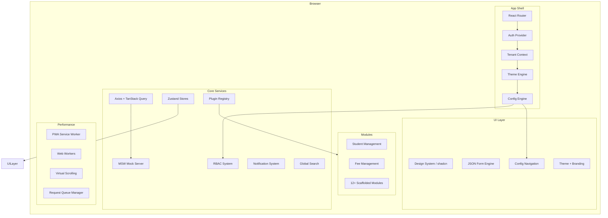
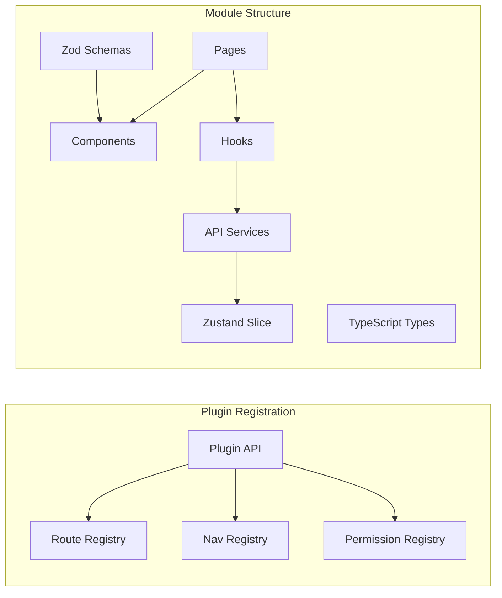
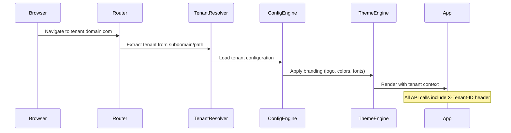
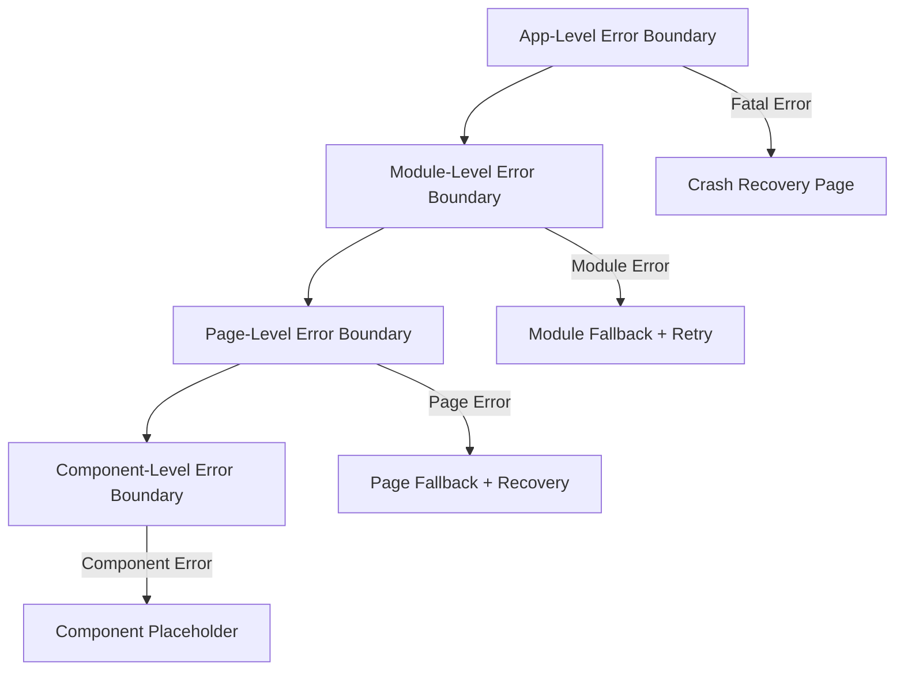

# Design Document: Multi-Tenant SaaS ERP UI

## Overview

This design document describes the architecture and implementation of a production-grade, multi-tenant SaaS ERP UI platform for educational institutions. The platform is UI-only with a centralized mock API system, supporting white-label branding, role-based access control (RBAC), config-driven navigation, modular architecture, and comprehensive institutional management.

The platform serves schools, colleges, and universities with two fully-implemented modules (Student Management, Fee Management) and 12+ scaffolded modules. It uses React + TypeScript with strict mode, Vite for build tooling, and a plugin architecture for extensibility.

### Key Design Decisions

1. **Multi-tenant isolation at UI layer**: Tenant context is resolved from subdomain/URL and propagated through React Context. All API calls include tenant ID headers.
2. **Config-driven architecture**: Navigation, forms, workflows, and feature flags are all driven by JSON configuration, enabling per-tenant customization without code changes.
3. **Mock-first development**: A centralized mock server (MSW-based) intercepts all API calls, enabling full UI development without a backend.
4. **Plugin architecture**: Modules register via a plugin API, enabling dynamic loading and feature flag control.
5. **Performance-first**: Virtual scrolling, code splitting, request deduplication, and Web Workers are used from the start to handle large datasets.

## Architecture

### High-Level Architecture



### Module Architecture



### Tenant Resolution Flow



## Components and Interfaces

### Core Provider Hierarchy

```typescript
// src/providers/AppProviders.tsx
interface AppProvidersProps {
  children: React.ReactNode;
}

// Provider nesting order (outermost to innermost):
// QueryClientProvider > AuthProvider > TenantProvider > ThemeProvider > ConfigProvider > NotificationProvider
```

### Tenant System

```typescript
// src/types/tenant.ts
interface TenantConfig {
  id: string;
  name: string;
  subdomain: string;
  customDomain?: string;
  branding: TenantBranding;
  modules: ModuleConfig[];
  featureFlags: Record<string, boolean>;
  locale: LocaleConfig;
  academicYear: AcademicYearConfig;
  feeStructure: FeeStructureConfig;
  admissionWorkflow: WorkflowConfig;
  emailTemplates: NotificationTemplate[];
  smsTemplates: NotificationTemplate[];
}

interface TenantBranding {
  logo: string;
  favicon: string;
  primaryColor: string;
  secondaryColor: string;
  accentColor: string;
  fontFamily: string;
  schoolTheme: 'school' | 'college' | 'university';
}

interface LocaleConfig {
  defaultLocale: string;
  supportedLocales: string[]; // minimum 2
  dateFormat: string;
  currencyCode: string;
  numberFormat: string;
  direction: 'ltr' | 'rtl';
}
```

### RBAC System

```typescript
// src/types/rbac.ts
type BuiltInRole = 'super_admin' | 'school_admin' | 'accountant' | 'teacher' | 'staff' | 'parent' | 'student';

type PermissionLevel = 'module' | 'page' | 'action';
type ActionPermission = 'view' | 'edit' | 'delete' | 'export' | 'create' | 'approve' | 'assign';

interface Permission {
  resource: string;
  level: PermissionLevel;
  actions: ActionPermission[];
  scope?: DataScope;
}

interface DataScope {
  classes?: string[];
  sections?: string[];
  departments?: string[];
  grades?: string[];
}

interface Role {
  id: string;
  name: string;
  type: 'built_in' | 'custom';
  hierarchy: number; // lower = more privileged
  permissions: Permission[];
  inheritsFrom?: string; // role id
}

// src/hooks/usePermission.ts
interface UsePermissionReturn {
  hasPermission: (resource: string, action: ActionPermission) => boolean;
  hasModuleAccess: (moduleId: string) => boolean;
  hasPageAccess: (pageId: string) => boolean;
  permissions: Permission[];
  role: Role;
  isImpersonating: boolean;
}

// src/components/withPermission.tsx
interface WithPermissionProps {
  resource: string;
  action: ActionPermission;
  fallback?: React.ReactNode;
  disableMode?: boolean; // show disabled vs hide
}
```

### Config Engine

```typescript
// src/types/config.ts
interface NavigationConfig {
  items: NavigationItem[];
  maxDepth: 4;
}

interface NavigationItem {
  id: string;
  label: string;
  icon: string;
  path?: string;
  children?: NavigationItem[];
  permissions: string[];
  badgeCount?: () => number;
  featureFlag?: string;
  group?: string;
}

interface FormSchema {
  id: string;
  version: string;
  fields: FormField[];
  layout: FormLayout;
  validation: ZodSchema;
  maxFields: 200; // limit
  maxSizeKB: 500; // limit
}

interface FormField {
  name: string;
  type: FieldType;
  label: string;
  placeholder?: string;
  required?: boolean;
  validation?: ValidationRule[];
  conditional?: ConditionalVisibility;
  dependsOn?: string[];
  options?: FieldOption[];
}

type FieldType = 
  | 'text' | 'textarea' | 'number' | 'email' | 'phone'
  | 'select' | 'multiselect' | 'combobox'
  | 'date' | 'daterange' | 'time'
  | 'checkbox' | 'radio' | 'switch'
  | 'file' | 'image' | 'richtext'
  | 'section' | 'repeater' | 'group';

interface WorkflowConfig {
  id: string;
  name: string;
  steps: WorkflowStep[]; // max 30
  currentStep: number;
}
```

### Plugin Architecture

```typescript
// src/types/plugin.ts
interface PluginDefinition {
  id: string;
  name: string;
  version: string;
  routes: RouteDefinition[];
  navigation: NavigationItem[];
  permissions: Permission[];
  settingsPanels?: SettingsPanel[];
  dashboardWidgets?: DashboardWidget[];
  lifecycle: PluginLifecycle;
}

interface PluginLifecycle {
  onInit: () => Promise<void>;
  onDestroy: () => Promise<void>;
  onActivate: () => void;
  onDeactivate: () => void;
}

interface PluginRegistry {
  register: (plugin: PluginDefinition) => void;
  unregister: (pluginId: string) => void;
  getPlugin: (pluginId: string) => PluginDefinition | undefined;
  getAllPlugins: () => PluginDefinition[];
  emit: (event: string, payload: unknown) => void;
  on: (event: string, handler: EventHandler) => () => void;
}
```

### API Client and Mock Server

```typescript
// src/services/api-client.ts
interface APIClientConfig {
  baseURL: string;
  tenantId: string;
  authToken: string;
  requestQueue: {
    maxConcurrent: 6;
    priorityLevels: ['critical', 'user', 'background', 'prefetch'];
  };
  deduplication: {
    windowMs: 2000;
  };
  retry: {
    maxRetries: 3;
    delays: [1000, 2000, 4000]; // exponential backoff
  };
  circuitBreaker: {
    failureThreshold: 5;
    windowMs: 30000;
    cooldownMs: 60000;
  };
}

// src/mock/server.ts
interface MockServerConfig {
  latency: { min: 300; max: 1500 };
  errorProbability: number; // 0-100%
  pagination: { defaultSize: 20; maxSize: 100 };
  datasetSize: { min: 500; max: 2000 }; // students per tenant
  networkSpeed: 'unlimited' | '3g' | 'slow2g';
  rateLimiting: { enabled: boolean; retryAfter: number };
  pollingInterval: { min: 1000; max: 30000; default: 5000 };
}
```

### Session Manager

```typescript
// src/services/session-manager.ts
interface SessionManager {
  login: (credentials: LoginCredentials) => Promise<AuthResult>;
  logout: () => Promise<void>;
  refreshToken: () => Promise<string>;
  getToken: () => string | null;
  isAuthenticated: () => boolean;
  getActiveSessions: () => SessionInfo[];
  revokeSession: (sessionId: string) => Promise<void>;
  onSessionExpired: (handler: () => void) => void;
  onForceLogout: (handler: () => void) => void;
}

interface SessionConfig {
  idleTimeout: 900000; // 15 minutes
  warningBefore: 120000; // 2 minutes
  maxRequestsPerWindow: 100;
  requestWindowMs: 10000;
  tokenRotation: boolean;
  tabSync: boolean; // BroadcastChannel sync
}
```

### Student Module Interfaces

```typescript
// src/modules/student/types.ts
interface Student {
  id: string;
  studentId: string;
  tenantId: string;
  personal: PersonalInfo;
  academic: AcademicInfo;
  contact: ContactInfo;
  medical: MedicalInfo;
  guardians: Guardian[];
  documents: StudentDocument[];
  feeHistory: FeeRecord[];
  photo?: string;
  status: 'active' | 'inactive' | 'graduated' | 'transferred' | 'suspended';
  admissionDate: string;
  createdAt: string;
  updatedAt: string;
}

interface StudentListParams {
  page: number;
  pageSize: number; // default 25
  search?: string;
  filters: {
    class?: string;
    section?: string;
    status?: string;
    admissionYear?: string;
  };
  sort?: { field: string; direction: 'asc' | 'desc' };
}

interface BulkImportConfig {
  maxFileSize: 10485760; // 10MB
  maxRecords: 5000;
  supportedFormats: ['csv', 'xlsx'];
}

interface BulkPromotionConfig {
  maxBatchSize: 200;
}
```

### Fee Module Interfaces

```typescript
// src/modules/fee/types.ts
interface FeeStructure {
  id: string;
  tenantId: string;
  name: string;
  categories: FeeCategory[];
  applicableGroups: string[];
  academicYear: string;
}

interface FeeCategory {
  id: string;
  name: string;
  subCategories: FeeSubCategory[];
  amount: number;
  dueDate: string;
  latePenalty: LatePenaltyConfig;
  earlyDiscount: EarlyDiscountConfig;
  recurringSchedule?: RecurringSchedule;
}

interface Payment {
  id: string;
  studentId: string;
  tenantId: string;
  amount: number;
  method: 'cash' | 'card' | 'bank_transfer' | 'cheque' | 'online';
  reference: string;
  receiptNumber: string;
  status: 'pending' | 'completed' | 'failed' | 'refunded';
  isPartial: boolean;
  isAdvance: boolean;
  breakdown: PaymentBreakdown[];
  createdAt: string;
}

interface FeeDefaulterReport {
  student: Student;
  totalDue: number;
  ageing: {
    days30: number;
    days60: number;
    days90Plus: number;
  };
  parentContact: ContactInfo;
  lastPaymentDate?: string;
}

interface FeeAnalytics {
  collectionTrends: TimeSeriesData[];
  outstandingAmount: number;
  paymentMethodDistribution: PieChartData[];
  monthOverMonth: ComparisonData[];
}
```

### Performance Infrastructure

```typescript
// src/services/request-queue.ts
interface RequestQueueManager {
  enqueue: (request: QueuedRequest) => Promise<Response>;
  cancelByPriority: (priority: Priority) => void;
  getPendingCount: () => number;
  getConfig: () => QueueConfig;
}

interface QueueConfig {
  maxConcurrent: 6;
  maxPending: 50;
  priorities: ['critical', 'user', 'background', 'prefetch'];
}

// src/services/web-worker-pool.ts
interface WorkerPool {
  execute: <T>(task: WorkerTask) => Promise<T>;
  terminate: () => void;
}

type WorkerTask = 
  | { type: 'csv-parse'; payload: ArrayBuffer }
  | { type: 'data-transform'; payload: { data: unknown[]; transform: string } }
  | { type: 'filter-large-list'; payload: { items: unknown[]; filters: Filter[] } };
```

## Data Models

### Entity Relationship Diagram

```mermaid
erDiagram
    TENANT ||--o{ USER : has
    TENANT ||--o{ MODULE_CONFIG : configures
    TENANT ||--o{ FEE_STRUCTURE : defines
    TENANT ||--o{ ACADEMIC_YEAR : has
    TENANT ||--o{ WORKFLOW : configures
    
    USER ||--o{ ROLE : assigned
    ROLE ||--o{ PERMISSION : grants
    
    TENANT ||--o{ STUDENT : enrolls
    STUDENT ||--o{ DOCUMENT : uploads
    STUDENT ||--o{ FEE_RECORD : owes
    STUDENT ||--o{ ATTENDANCE : tracks
    STUDENT }o--o{ GUARDIAN : "has guardian"
    
    FEE_STRUCTURE ||--o{ FEE_CATEGORY : contains
    FEE_CATEGORY ||--o{ FEE_SUBCATEGORY : contains
    FEE_RECORD ||--o{ PAYMENT : receives
    PAYMENT ||--|| RECEIPT : generates
    
    ACADEMIC_YEAR ||--o{ TERM : contains
    ACADEMIC_YEAR ||--o{ CLASS : organizes
    CLASS ||--o{ SECTION : divides
    
    WORKFLOW ||--o{ WORKFLOW_STEP : contains
    WORKFLOW ||--o{ APPROVAL_REQUEST : processes
    APPROVAL_REQUEST ||--o{ APPROVAL_ACTION : tracks
```

### State Management (Zustand)

```typescript
// src/store/index.ts - Store slices
interface AppStore {
  // Auth slice
  auth: {
    user: User | null;
    token: string | null;
    isAuthenticated: boolean;
    isImpersonating: boolean;
    impersonatedRole?: BuiltInRole;
    sessions: SessionInfo[];
  };
  
  // Tenant slice
  tenant: {
    current: TenantConfig | null;
    isLoading: boolean;
    error: string | null;
  };
  
  // UI slice
  ui: {
    sidebarCollapsed: boolean;
    theme: 'light' | 'dark' | 'system';
    locale: string;
    notifications: Notification[];
    unreadCount: number;
    commandPaletteOpen: boolean;
    globalSearchOpen: boolean;
  };
  
  // Bulk operations slice
  bulkOps: {
    activeOperations: BulkOperation[];
    history: BulkOperationResult[];
  };
}
```

### TanStack Query Key Structure

```typescript
// src/services/query-keys.ts
const queryKeys = {
  students: {
    all: (tenantId: string) => ['students', tenantId] as const,
    list: (tenantId: string, params: StudentListParams) => ['students', tenantId, 'list', params] as const,
    detail: (tenantId: string, id: string) => ['students', tenantId, 'detail', id] as const,
    timeline: (tenantId: string, id: string) => ['students', tenantId, 'timeline', id] as const,
  },
  fees: {
    all: (tenantId: string) => ['fees', tenantId] as const,
    structure: (tenantId: string, yearId: string) => ['fees', tenantId, 'structure', yearId] as const,
    payments: (tenantId: string, params: PaymentListParams) => ['fees', tenantId, 'payments', params] as const,
    defaulters: (tenantId: string) => ['fees', tenantId, 'defaulters'] as const,
    analytics: (tenantId: string) => ['fees', tenantId, 'analytics'] as const,
  },
  config: {
    tenant: (tenantId: string) => ['config', tenantId] as const,
    navigation: (tenantId: string, role: string) => ['config', tenantId, 'navigation', role] as const,
    featureFlags: (tenantId: string) => ['config', tenantId, 'flags'] as const,
  },
} as const;
```

## Correctness Properties

*A property is a characteristic or behavior that should hold true across all valid executions of a system — essentially, a formal statement about what the system should do. Properties serve as the bridge between human-readable specifications and machine-verifiable correctness guarantees.*

### Property 1: Tenant Branding Resolution

*For any* tenant branding configuration (complete or partial), applying it through the Theme Engine SHALL produce CSS custom properties where every valid field matches the config value and every missing/invalid field falls back to the platform default, with no field left undefined.

**Validates: Requirements 1.1, 1.11**

### Property 2: Tenant Data Isolation

*For any* API request constructed by the platform, the tenant identifier in the request headers SHALL always match the authenticated session's tenant identifier. Any request where these differ SHALL be rejected without revealing the target tenant's existence.

**Validates: Requirements 1.2, 1.9, 1.12**

### Property 3: Config-Driven Navigation Generation

*For any* tenant configuration with enabled modules, disabled modules, user role, and permission set, the generated sidebar navigation SHALL contain only items where: (a) the module is enabled, (b) the user's role has at least page-level access, and (c) the navigation depth does not exceed 4 levels.

**Validates: Requirements 1.3, 3.1, 3.5**

### Property 4: RBAC Permission Resolution

*For any* user with an assigned role and permission set, the `hasPermission(resource, action)` function SHALL return true if and only if the user's role (including inherited permissions from lower-hierarchy roles) grants the specified action on the specified resource within the user's data scope.

**Validates: Requirements 2.1, 2.3, 2.5, 2.8, 2.11**

### Property 5: Privilege Escalation Prevention

*For any* School_Admin creating or modifying a custom role, the resulting role's effective permission set SHALL be a subset of the School_Admin's own permission set. No custom role SHALL contain a permission not held by its creator.

**Validates: Requirements 2.13**

### Property 6: JSON Schema Form Rendering

*For any* valid form schema (within 200 fields, 500KB limit), the form engine SHALL render exactly the fields defined in the schema with correct types, and validation SHALL accept inputs conforming to the schema's rules and reject inputs violating them.

**Validates: Requirements 3.2, 3.7**

### Property 7: Workflow Step Execution with Skip Logic

*For any* workflow configuration with steps (max 30), if a step references a disabled module, execution SHALL skip that step and proceed to the next valid step. The total executed steps SHALL equal total steps minus disabled-module steps.

**Validates: Requirements 3.4**

### Property 8: Breadcrumb Generation

*For any* navigation path from root to current page, the breadcrumb generator SHALL produce segments representing the full path, with a maximum of 6 visible segments. Paths exceeding 6 levels SHALL truncate intermediate segments with an ellipsis indicator.

**Validates: Requirements 3.6**

### Property 9: List Filtering Correctness

*For any* dataset (students, payments, or records) and any combination of filter parameters (search, class, section, status, date range, amount range), every item in the filtered result SHALL satisfy ALL active filter criteria, and no item satisfying all criteria SHALL be excluded.

**Validates: Requirements 7.1, 7.16, 8.2**

### Property 10: Document Upload Validation

*For any* file metadata (type, size) submitted for upload, the validation SHALL accept files with type in {PDF, JPG, PNG, DOCX} AND size ≤ 5MB AND student document count < 20, and SHALL reject files violating any of these constraints.

**Validates: Requirements 7.4**

### Property 11: Admission Form Validation Round-Trip

*For any* valid admission form input conforming to the Zod schema, serializing to JSON and deserializing SHALL produce an equivalent object. Invalid inputs SHALL produce Zod validation errors identifying the failing fields.

**Validates: Requirements 7.3**

### Property 12: Batch Operation Partial Failure Handling

*For any* batch of records (up to 200 for promotion, 5000 for import), if some records are valid and some invalid, the system SHALL process all valid records successfully, report exact failure reasons for each invalid record, and the final summary count SHALL equal valid_count + invalid_count = total_count.

**Validates: Requirements 7.9, 7.11, 7.12**

### Property 13: Concurrent Edit Conflict Detection

*For any* record with a version timestamp, if the local version is older than the server version at save time, the system SHALL detect a conflict and present the diff rather than silently overwriting.

**Validates: Requirements 7.15, 20.2**

### Property 14: Fee Ageing Calculation

*For any* set of fee records with due dates, the ageing calculation SHALL correctly bucket outstanding amounts into 30-day (1-30 days overdue), 60-day (31-60 days), and 90+-day (61+ days) categories, where the sum of all buckets equals the total outstanding amount.

**Validates: Requirements 8.7**

### Property 15: Fee Discount and Concession Calculation

*For any* fee amount with applicable concessions (scholarships, sibling discounts), the calculated payable amount SHALL equal the original amount minus all valid discounts, and SHALL never be negative.

**Validates: Requirements 8.9**

### Property 16: Recurring Fee Installment Generation

*For any* recurring fee schedule configuration (frequency, start date, end date, amount), the generated installments SHALL have dates matching the recurrence pattern, amounts summing to the expected total, and due dates falling within the academic year.

**Validates: Requirements 8.11**

### Property 17: Optimistic UI State Consistency

*For any* optimistic state update followed by an API response, if the API succeeds the state SHALL reflect the update, and if the API fails the state SHALL revert to the pre-update value with no intermediate inconsistency.

**Validates: Requirements 8.5**

### Property 18: Request Queue Priority Ordering

*For any* set of enqueued API requests with assigned priorities (critical > user > background > prefetch), the queue SHALL process higher-priority requests before lower-priority ones. When pending count exceeds 50, all prefetch and background requests SHALL be cancelled.

**Validates: Requirements 27.1, 27.2, 27.3**

### Property 19: Circuit Breaker State Machine

*For any* sequence of API responses to the same endpoint, if 5 consecutive failures occur within 30 seconds, the circuit SHALL open (reject new requests). After the cooldown period, the circuit SHALL transition to half-open and allow a test request. A success closes the circuit; a failure re-opens it.

**Validates: Requirements 27.10**

### Property 20: Request Deduplication

*For any* two identical GET requests issued within a 2-second sliding window, the system SHALL return the same cached promise for both, resulting in exactly one network call. Requests outside the window SHALL trigger a new network call.

**Validates: Requirements 27.12**

### Property 21: Session Request Throttling

*For any* user session, the request count within a 10-second window SHALL not exceed 100 outgoing requests. Excess requests SHALL be queued (not dropped) and processed when capacity becomes available.

**Validates: Requirements 28.10**

### Property 22: Sensitive Data Masking by Role

*For any* data record with classified fields and any viewing user role, fields with classification level exceeding the role's clearance SHALL be masked/redacted in the rendered output. Fields within clearance SHALL be displayed in full.

**Validates: Requirements 31.6**

### Property 23: Internationalization Formatting

*For any* numeric value, date, or currency amount and any supported locale configuration, the formatting function SHALL produce output matching the locale's rules (date format, decimal separator, currency symbol position, plural form).

**Validates: Requirements 34.3, 34.4**

### Property 24: Workflow Approval State Machine

*For any* approval workflow with configured completion rules, the workflow SHALL advance to the next step if and only if the completion condition is met (all approvers approved for "all" mode, or any one approved for "any" mode). Parallel approvals SHALL be evaluable independently.

**Validates: Requirements 35.4**

### Property 25: Tenant Subdomain Resolution

*For any* URL with a subdomain or custom domain, the tenant resolver SHALL map it to exactly one tenant configuration. Unknown subdomains/domains SHALL result in a "tenant not found" response without revealing other tenant identifiers.

**Validates: Requirements 1.8**

### Property 26: Admission Pipeline State Transitions

*For any* applicant in the admission pipeline and any configured transition rule, the state machine SHALL only allow transitions that follow the defined stage sequence (Inquiry → Application → Document Verification → Interview/Test → Offer → Accepted → Enrolled). Backward transitions SHALL only be allowed for Rejected state.

**Validates: Requirements 25.1, 25.4**

### Property 27: Pagination Correctness

*For any* dataset and pagination parameters (page, pageSize where pageSize ≤ 100), the returned page SHALL contain exactly min(pageSize, remaining_records) items, with correct total count metadata, and the union of all pages SHALL equal the full filtered dataset with no duplicates or omissions.

**Validates: Requirements 4.3**

### Property 28: Retry Delay Calculation

*For any* retry attempt number n (1 ≤ n ≤ 3), the calculated delay SHALL equal 2^(n-1) seconds (1s, 2s, 4s). No retry SHALL be attempted after the 3rd failure.

**Validates: Requirements 10.3**


## Error Handling

### Error Boundary Strategy



### Error Categories and Responses

| Error Type | HTTP Code | UI Response | Recovery Action |
|---|---|---|---|
| Authentication | 401 | Session expired modal | Re-login with URL preservation |
| Authorization | 403 | Permission denied page | Show required permission + admin contact |
| Not Found | 404 | Not found page | Navigate back or home |
| Conflict | 409 | Conflict resolution modal | Show diff + merge/override options |
| Validation | 422 | Inline field errors | Highlight fields + preserve data |
| Rate Limit | 429 | "High traffic" notification | Respect Retry-After, queue requests |
| Server Error | 500 | Toast + retry action | Exponential backoff retry (3 attempts) |
| Network | - | Offline banner | Queue actions, retry on reconnect |

### Error Reporting Pipeline

```typescript
// src/services/error-reporter.ts
interface ErrorReport {
  id: string;
  timestamp: string;
  error: {
    message: string;
    stack: string;
    code?: string;
  };
  context: {
    userId: string;
    tenantId: string;
    role: string;
    route: string;
    action: string;
  };
  environment: {
    browser: string;
    version: string;
    viewport: string;
    locale: string;
  };
  reproduction?: {
    steps: string[];
    lastActions: UserAction[];
  };
}
```

### Resilience Patterns

1. **Retry with exponential backoff**: 1s → 2s → 4s for transient failures
2. **Circuit breaker**: Open after 5 failures in 30s, cooldown 60s
3. **Request deduplication**: 2s sliding window for identical GETs
4. **Optimistic updates with rollback**: Apply immediately, revert on failure
5. **Stale-while-revalidate**: Show cached data while refreshing
6. **Graceful degradation**: Partial data rendering with missing field indicators
7. **Batch error notifications**: Aggregate multiple simultaneous errors into single toast
8. **Offline queue**: Queue mutations when disconnected, replay on reconnect

### Form Error Handling

- All form data is preserved on submission failure
- Inline validation messages appear on field blur and submit
- Server-side validation errors map to specific fields
- Autosave failures show warning indicator with local storage backup
- Duplicate submission prevention via button disable after first click

## Testing Strategy

### Testing Stack

| Layer | Tool | Purpose |
|---|---|---|
| Unit Tests | Vitest | Pure functions, hooks, utilities |
| Property Tests | fast-check + Vitest | Universal properties across generated inputs |
| Component Tests | React Testing Library | Component rendering and interaction |
| Integration Tests | MSW + Vitest | API integration, mock server behavior |
| E2E Tests | Playwright | Critical user flows |
| Visual Tests | Storybook + Chromatic | Component visual regression |
| Performance | Lighthouse CI | Bundle size, Core Web Vitals |

### Property-Based Testing Configuration

- **Library**: fast-check (with Vitest runner)
- **Minimum iterations**: 100 per property test
- **Tag format**: `Feature: multi-tenant-saas-erp-ui, Property {N}: {title}`
- **Each property test implements exactly one correctness property from the design**

### Property Test Coverage Map

| Property | Module Under Test | Key Generator Strategy |
|---|---|---|
| P1: Branding Resolution | Theme Engine | Random TenantBranding with optional null fields |
| P2: Tenant Isolation | API Client | Random (sessionTenant, requestTenant) pairs |
| P3: Navigation Generation | Config Engine | Random module lists with roles and permissions |
| P4: RBAC Resolution | RBAC System | Random role hierarchies with permission sets |
| P5: Privilege Escalation | RBAC System | Random admin permissions + attempted custom roles |
| P6: Form Rendering | Form Engine | Random JSON schemas within size limits |
| P7: Workflow Skip | Config Engine | Random workflows with disabled modules |
| P8: Breadcrumb | Navigation | Random paths of varying depth |
| P9: List Filtering | Data Layer | Random datasets + filter combinations |
| P10: Upload Validation | Student Module | Random file metadata (type, size, count) |
| P11: Form Validation | Student Module | Random admission inputs (valid/invalid) |
| P12: Batch Operations | Student Module | Random batches with mixed validity |
| P13: Conflict Detection | Data Layer | Random version pairs |
| P14: Fee Ageing | Fee Module | Random fee records with due dates |
| P15: Discount Calculation | Fee Module | Random amounts + discount configs |
| P16: Installment Generation | Fee Module | Random recurring schedules |
| P17: Optimistic UI | State Layer | Random state + success/failure outcomes |
| P18: Request Queue | Request Manager | Random requests with priorities |
| P19: Circuit Breaker | API Client | Random success/failure sequences |
| P20: Deduplication | API Client | Random request pairs with timestamps |
| P21: Throttling | Session Manager | Random request arrival patterns |
| P22: Data Masking | Privacy Layer | Random records + roles + classifications |
| P23: i18n Formatting | i18n Service | Random values + locales |
| P24: Workflow Approval | Workflow Engine | Random approval states + rules |
| P25: Tenant Resolution | Tenant Resolver | Random URLs with subdomains |
| P26: Pipeline Transitions | Admission Module | Random applicant states + transitions |
| P27: Pagination | Data Layer | Random datasets + page params |
| P28: Retry Delay | API Client | Random attempt numbers |

### Unit Test Focus Areas

- Specific examples for UI component behavior (render states, interactions)
- Edge cases: localStorage full, rapid clicks, upload interruption, browser incompatibility
- Error boundary isolation verification
- Theme toggle persistence
- Session timeout flow
- Form autosave with timer mocks

### Integration Test Focus Areas

- Mock server latency simulation (300-1500ms range)
- Error response simulation (401, 403, 404, 409, 422, 429, 500)
- File upload progress callbacks
- Polling interval configuration
- In-memory data persistence across session
- Cross-tab BroadcastChannel synchronization
- Web Worker task execution

### E2E Test Scenarios

1. Tenant onboarding wizard (complete flow)
2. Student admission (form → document upload → submit)
3. Fee payment (structure → payment → receipt)
4. Login → RBAC route protection → permission denied
5. Bulk import (CSV upload → mapping → validation → import)
6. Global search across modules
7. Theme switch + locale change persistence
8. Offline detection → queue actions → reconnect → replay

### Performance Budgets

| Metric | Budget |
|---|---|
| Initial bundle (gzipped) | < 200KB |
| Per-route chunk | < 200KB gzipped |
| First Input Delay (FID) | < 100ms |
| Cumulative Layout Shift (CLS) | < 0.1 |
| Table with 10,000 rows | 60fps scroll (< 16ms frame) |
| Main thread block | < 50ms per task |
| DOM nodes per route (initial) | < 50 |
